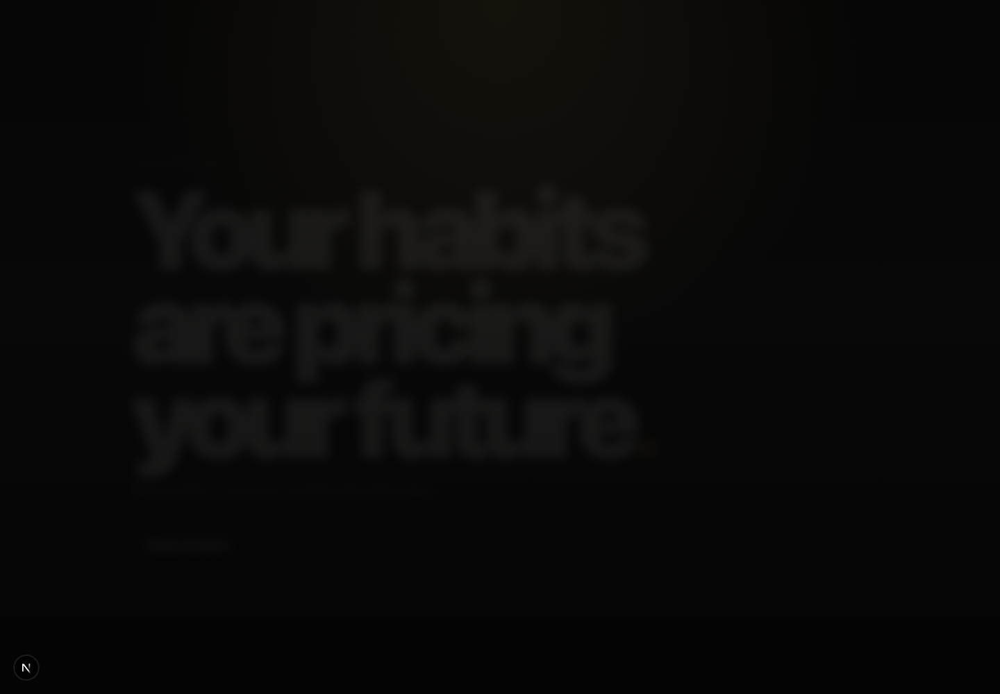

# ShadowWorth AI

> Your habits are pricing your future.

ShadowWorth AI is a cinematic AI psychological mirror that visualizes invisible financial self-destruction from current behavior.

It is not a budgeting app, finance tracker, or generic analytics dashboard. It is an emotionally paced product experience that asks a sharper question:

**What is the future cost of the person you keep becoming every day?**



## Product Direction

ShadowWorth is designed like a psychological reveal, not a SaaS dashboard.

The experience begins almost empty: one sentence, one button, silence. When the user begins analysis, the system slowly exposes behavioral signals, future divergence, lost acceleration, and the hidden leaks widening the gap between current self and optimized self.

## Core Feature

### Future Divergence Engine

The main interaction compares two timelines:

- **Current Self:** projected yearly growth if the present behavior pattern continues
- **Optimized Self:** projected yearly growth if attention, learning, and spending behavior improve
- **Divergence:** estimated lifetime potential gap between those two futures

This is the emotional center of the product.

## What It Measures

- Screen-time attention bleed
- Delayed skill-building
- Procrastination drag
- Impulse-spending residue
- Unused subscription leakage
- Sleep and routine consistency

## Experience Principles

- Cinematic restraint over flashy UI
- Negative space over dashboard clutter
- Emotional copy over generic metrics
- Slow reveal over instant information dump
- Future divergence over ordinary charts

## Tech Stack

- Next.js
- React
- TypeScript
- Framer Motion
- Lenis smooth scrolling
- Canvas visualization
- GSAP and Three.js included for future cinematic motion layers

## Run Locally

```bash
npm install
npm run dev
```

Open:

```text
http://localhost:4173
```

## Production Check

```bash
npm run check
```

This runs TypeScript validation and a production Next.js build.

## GitHub Upload

```bash
git remote add origin https://github.com/YOUR_USERNAME/shadowworth-ai.git
git push -u origin main
```

## Disclaimer

ShadowWorth AI is an educational prototype. Its estimates are model-based projections, not financial advice.
